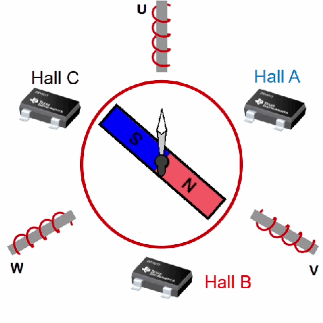
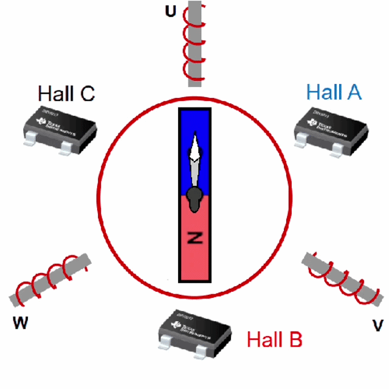

# BLDC Motor Simulation
Simple physics simulation of Brush-Less Direct Current (BLDC) motor. Demostrating movement of rotor.
Sit back and enjoy developing your BLDC controller in a fully software simulated enviorement.

## Theory of operation
Excellent tutorial by **Jentzen Lee** is below. It inspired me to write this simulation:\
https://www.youtube.com/playlist?list=PLaBr_WzeIAixidGwqfcrQlwKZX4RZ2E7D

https://www.youtube.com/@jtlee1108

https://guy.soffer.tech/tutorials/bldc-motor-control

## Why?
1. To be an interactive tool and support tutorials on BLDC motor opration.
2. To interact with the controller during development (Software In The Loop). This eliminates the needs for any hardware during early stages of controller develop.

## What does it simulate / demonstrate
- Rotor and stator magnetic fields and interaction.
- Mechanical motion of the rotor.
- Clarke and inverse Clarke transformations.
- Kv, Kt, resistance, phase-voltage, rotor-inertia, viscosity and friction coeficiants.
- Simplified electrical solver for currents in 3-phase half H-bridge acounting for back-emf in the DC domain.

The demo application demonstrate smooth and step movement of the rotor by using an open-loop controller with 6 step commutation.

## Future plans
- Add Hall sensor and encoder outputs to API.
- Add more examples of controllers such as:
  - Open loop Space Vector Modulation (SVM).
  - Closed-loop 6 step commutation.
  - Closed-loop Field Oriented Control (FOC) with SVM.

Requires Python to run the EM_model (inclues dedicated unit-test). For visual support install pyGame and GSOF_Cockpit as well.

http://python.org/

http://www.pygame.org

https://github.com/mrGSOF/GSOF_Cockpit

## Running instructions
- Install requirements `pip install -r requirements.txt`
- Clone and install GSOF_Cockpit (`pip setup.py`)
- Clone bldcSim
- run `Demo_BLDC.py`

Interactive operation isn't supported yet.
